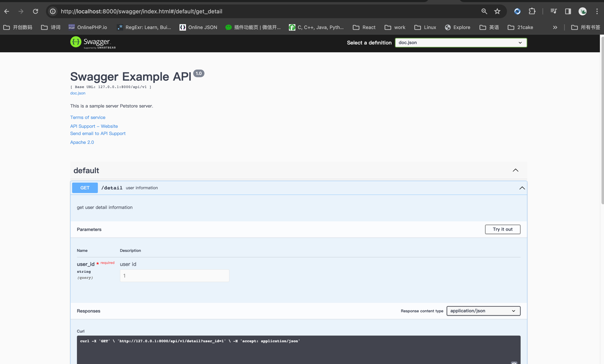

# iris-swagger

iris middleware to automatically generate RESTful API documentation with Swagger2.0

##Usage

Start using it
1. Add comments to you api source code
2. Download Swag for go by using:
```shell
$ go install github.com/swaggo/swag/cmd/swag@latest
```
3. Run the Swag in you Go project root folder which contains main.go file, Swag will parse comments and generate required files(docs folder and docs/doc.go)
```shell
$ swag init .
```
4. download iris-swagger by using:
```shell
$ go get -u github.com/dingjc89/iris-swagger
```

and import following in your code:
```go
import "github.com/dingjc89/iris-swagger"
```
##Canonical example
```go
package main

import (
	irisSwagger "github.com/dingjc89/iris-swagger"
	"github.com/dingjc89/iris-swagger/example/api"
	_ "github.com/dingjc89/iris-swagger/example/docs"
	"github.com/kataras/iris/v12"
	"github.com/kataras/iris/v12/middleware/cors"
	swaggerFiles "github.com/swaggo/files"
)

// @title Swagger Example API
// @version 1.0
// @description This is a sample server Petstore server.
// @termsOfService http://swagger.io/terms/

// @contact.name API Support
// @contact.url http://www.swagger.io/support
// @contact.email support@swagger.io

// @license.name Apache 2.0
// @license.url http://www.apache.org/licenses/LICENSE-2.0.html

// @host 127.0.0.1:8000
// @BasePath /api/v1
func main() {
	router := iris.New()
	router.UseRouter(cors.New().ExtractOriginFunc(cors.DefaultOriginExtractor).
		ReferrerPolicy(cors.NoReferrerWhenDowngrade).
		AllowOriginFunc(cors.AllowAnyOrigin).
		Handler())
	user := api.UserController{}
	router.Get("/api/v1/detail", (&user).Detail)

	router.Get("/swagger/{*}", irisSwagger.IrisWrapHandler(swaggerFiles.Handler))

	router.Listen(":8000")
}
```
6. Run it, and browser to http://127.0.0.1:8000/swagger/index.html, you can see Swagger 2.0 api documents.

 